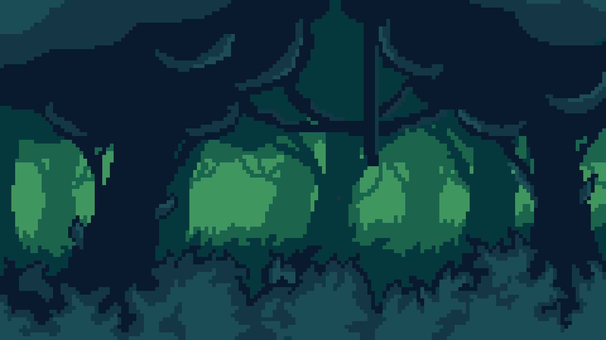
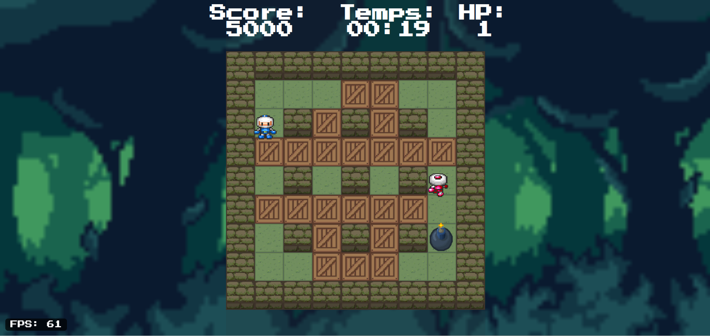
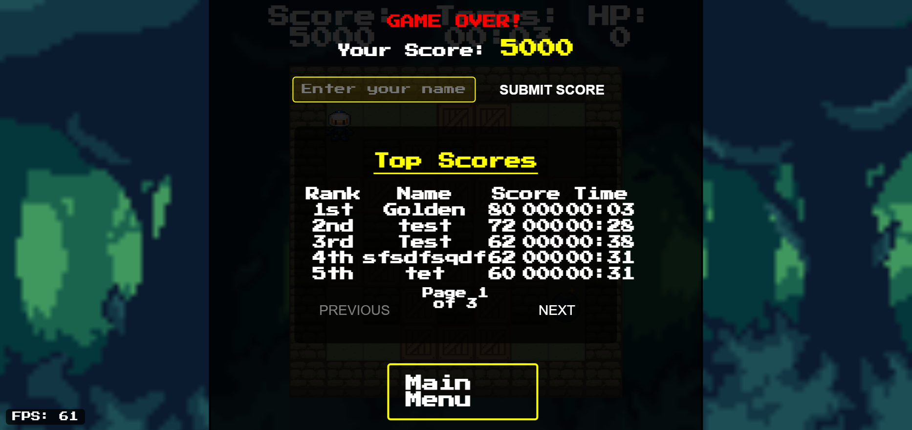
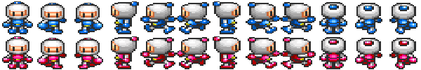

# BOMBERMAN Javascript



A classic Bomberman-style game built with vanilla JavaScript and DOM manipulation. This project demonstrates high-performance browser game development without frameworks or Canvas.

## 🎮 Game Overview

Bomberman is a strategic maze-based action game where players navigate through a grid-based level, placing bombs to destroy obstacles and defeat enemies. The goal is to clear paths, find power-ups, and ultimately reach the exit to advance to the next level.

### Key Features

- **Smooth 60+ FPS Gameplay**: Optimized for high performance with no frame drops
- **Keyboard Controls**: Responsive and fluid character movement
- **Pause Menu**: Includes continue and restart functionality
- **Scoreboard**: Displays countdown timer, score, and lives
- **DOM-based Rendering**: Efficient use of HTML elements instead of Canvas

### Screenshots




## 🛠️ Technical Implementation

### Performance Optimization

This game is built with performance as a priority, implementing:

- **RequestAnimationFrame**: For smooth animation loops synchronized with the browser's refresh rate
- **Layer Management**: Strategic DOM layering to minimize repaints
- **Transform & Opacity**: CSS properties that trigger only compositing instead of full repaints
- **Task Scheduling**: Optimized JavaScript execution to prevent jank

### Architecture

- **Object-Oriented Design**: Modular code structure following OOP principles
- **Event System**: Clean handling of user input and game events
- **State Management**: Proper game state tracking and transitions
- **Collision Detection**: Efficient algorithms for interaction between game elements

## 🎯 How to Play

1. Use **WASD** or **Arrow Keys** to move your character
2. Press **Space** to place bombs
3. Press **P** to pause the game
4. Destroy blocks to clear paths and find power-ups
5. Avoid enemies and your own bomb blasts!
6. Find the exit to progress to the next level

### Controls

| Key | Action |
|-----|--------|
| Z / ↑ | Move Up |
| Q / ← | Move Left |
| S / ↓ | Move Down |
| D / → | Move Right |
| Space | Place Bomb |
| Esc | Open Menu |

## 💻 Development

### Tech Stack

- HTML5
- CSS3
- Vanilla JavaScript
- DOM Manipulation

### Assets

- Character sprites:



- Bomb Animation sprites:


### Performance Metrics

This game has been optimized to achieve:

- **60+ FPS** during all gameplay
- **Zero frame drops** during animations
- **Minimal DOM updates** for better performance
- **Smooth transitions** between game states

## 🚀 Setup & Installation

1. Clone the repository:
   ```
   git clone https://github.com/Golden76z/bomberman_js
   ```

2. Navigate to the project folder:
   ```
   cd bomberman_js
   ```

3. Open `index.html` in your browser or use a local server:
   ```
   # Requires golang instalation
   go run main.go
   ```

4. Access the game at `http://localhost:8080`

## 📊 Performance Testing

To monitor the game's performance:

1. Open your browser's Developer Tools (F12 or Ctrl+Shift+I)
2. Navigate to the Performance tab
3. Click the Record button and play the game for a few seconds
4. Stop recording and analyze the FPS, CPU usage, and frame rendering times

## 🧠 Learning Resources

This project implements concepts discussed in:

- [JavaScript Event Loop](https://developer.mozilla.org/en-US/docs/Web/JavaScript/EventLoop)
- [requestAnimationFrame API](https://developer.mozilla.org/en-US/docs/Web/API/window/requestAnimationFrame)
- [Browser Rendering Performance](https://developers.google.com/web/fundamentals/performance/rendering)
- [DOM Optimization Techniques](https://developers.google.com/web/fundamentals/performance/critical-rendering-path/render-tree-construction)

## 🤝 Contributing

Contributions are welcome! Please feel free to submit a Pull Request.

1. Fork the repository
2. Create your feature branch (`git checkout -b feature/amazing-feature`)
3. Commit your changes (`git commit -m 'Add some amazing feature'`)
4. Push to the branch (`git push origin feature/amazing-feature`)
5. Open a Pull Request

## 📝 License

This project is licensed under the MIT License - see the [LICENSE](LICENSE) file for details.

## 🙏 Acknowledgements

- Original Bomberman game by Hudson Soft
- [MDN Web Docs](https://developer.mozilla.org/) for JavaScript references
- All contributors and testers who helped improve the game
